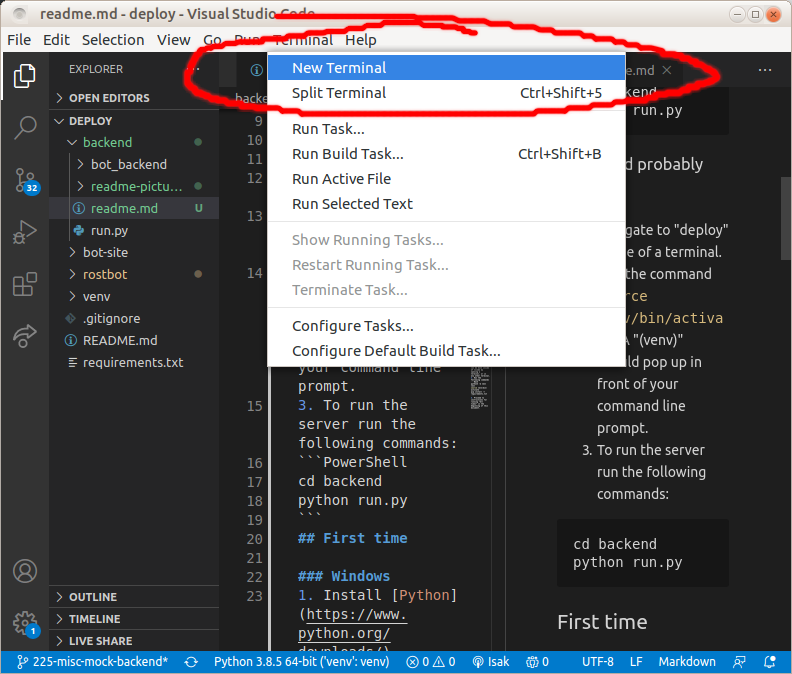

# Running instructions for python server

## All times
### Windows
1. Navigate to "deploy" inside of a powershell terminal.
2. Run the command `venv\scripts\Activate.ps1`. A "(venv)" should pop up in front of your command line prompt.


3. To run the server run run the following commands:
```PowerShell
cd backend
python run.py
```


You should now be able to access the routes defined in bot_backend/\_\_init\_\_.py. Test this by visiting [localhost:5000/available-times]() in a browser.

### Linux (and probably mac os)
1. Navigate to "deploy" inside of a terminal.
2. Run the command `source venv/bin/activate`. A "(venv)" should pop up in front of your command line prompt.


3. To run the server run the following commands:
```PowerShell
cd backend
python run.py
```


## First time
### Opening a terminal inside of vs code


### Windows
1. Install [Python](https://www.python.org/downloads/). Choose a version greater than 3.8.
2. Try running the command `python3 --version` in powershell. This can be done inside of vscode by opening a terminal. The command should output `Python 3.x.x`. If it doesn't find the install path of python3, locate it. Mine was installed in `C:\Users\USERNAME\AppData\Local\Programs\Python\Python3VERSION`. Copy the found path. To test it, you can run `C:\PATH\TO\PYTHON\python.exe --version`. It should output the same thing as below, maybe with a differing verison number.


3. Navigate to the folder "deploy" (The project folder) inside of powershell.
4. Run the following commands:
```PowerShell
python3 -m venv venv (or 'py -3 -m venv venv' if the other doesnt work)
venv\scripts\Activate.ps1
pip install -r requirements.txt
```
Or, if you used the long path:
```PowerShell
C:\PATH\TO\PYTHON\python.exe -m venv venv
venv\scripts\Activate.ps1
pip install -r requirements.txt
```
5. Proceed to instructions for running "All times" in the beginning of this document.
### Linux (and probably mac os)
1. Python is probably already installed on your computer. To verify, run `python3 --version` in a terminal. It should output `Python 3.x.x`. Make sure that the version is greater than 3.8. Otherwise, install a version of python that is greater than 3.8.


2. Navigate to the folder "deploy" (the project folder) inside of a terminal. This can be done inside of vscode by opening a terminal, or in any other terminal.
3. Run the following commands
```Bash
python3 -m venv venv
source vevn/bin/activate
pip install -r requirements.txt
```
4. Proceed to instructions for running "All times" in the beginning of this document.